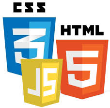

# Developing for Chromecast
---
# John Hiott
## @johnhiott
##  Cardinal Solutions
---
# Why the Chromecast?

- Affordable ($35.00)
- Hooks to any HDMI television.
- Tap in to the living room.
  - Avg. family watches 5 hours of television/day
- Cast enabled apps can be developed for Android, iOS and Chrome.

^ show the Chromecast and talk about using it today.
---
# Quick things to know

 - Chromecast is the device.
 - Casting is displaying media/app from a Cast enabled device on a Chromecast.
 - Cast is the technology used.
---
# How it works

---
